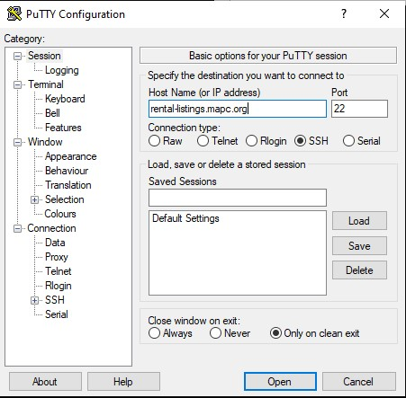
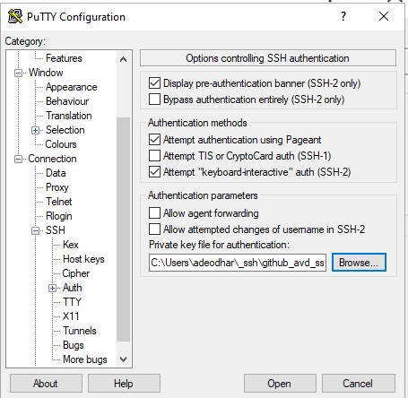
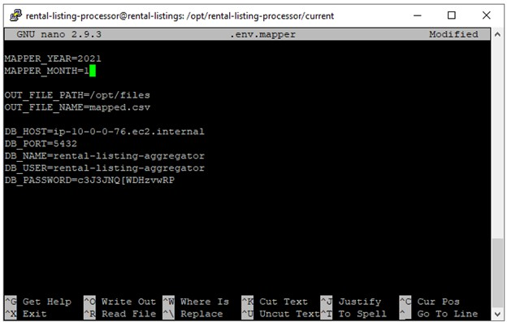
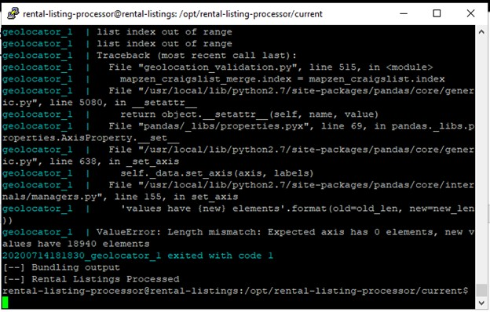
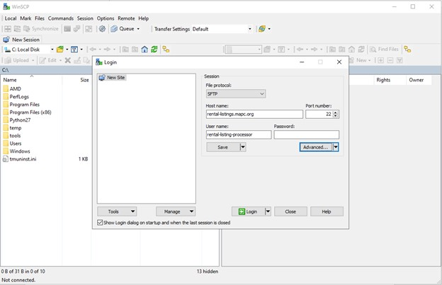
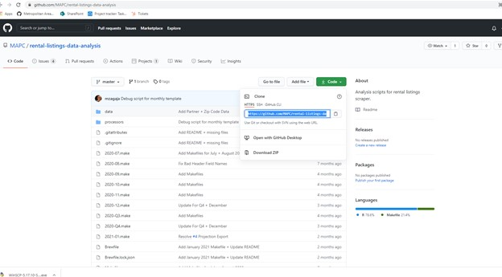
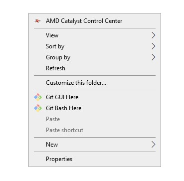
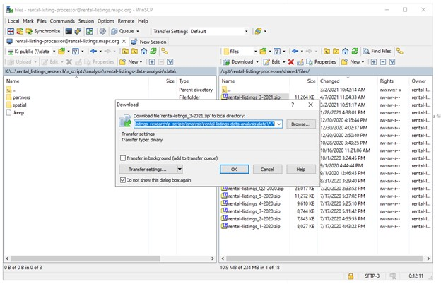

```{r setup, include=FALSE}
knitr::opts_chunk$set(echo = TRUE)
```

## rental-listings-processor

These are the steps required to be run for analysing and processing the raw rental listings.

### **1. Setting up Git for Windows**

You can skip this step if you already have an SSH key and PuTTy installed.

Follow the instructions on this page: [Setting up Git for Windows](https://gist.github.com/dmangiarelli/1a0ae107aaa5c478c51e)

Once you have a private SSH key saved on your system, please follow the following steps.

### **2. Run the deduplication processor:**

* **Open PuTTy**

  + Under the 'Sessions' tab, and 'Host Name' field, enter: **rental-listings.mapc.org**
  
  
  
  + Under the 'SSH' tab Auth tab, and browse to your private SSH key on your system.
  
  
  
  Hit 'Open'
  
* **Running the Deduplication Script**

  + When prompted for login id, enter **rental-listing-processor**
  
  + You will be prompted to enter your Github password

  + Ignore the ``` *** System restart required *** ```
  
  + Type: ``` cd /opt/rental-listing-processor ``` and **press enter**
  
  + Type: ``` cd current ``` and **press enter**
  
  + Type: ``` nano .env.mapper ``` and **press enter**
  
  + In the new window, you will be asked to enter the desired month/quarter/year.
  
  
  
  + For example, to run the processor for March 2021, enter the following:
  
```{}
MAPPER_YEAR=2021
MAPPER_MONTH=3
```
  
  + Similarly, if processing for Quarter 1 (ie January, February & March), replace ```MAPPER_MONTH``` with ```MAPPER_QUARTER=1```.
  
```{}
MAPPER_YEAR=2021
MAPPER_QUARTER=1
```
  
  + After entering the desired year and month values, press ```ctrl+x``` to exit. When prompted to save/overwrite, click Y.
  
  + Type: ```./process.py``` to run the python processing script. This should take between 15-30 minutes depending on whether processing monthly or quarterly data.
  
  + When the processor finishes its run, the following message will show up:
  
```{}
[--] Rental Listings Processed
rental-listing-processor@rental-listings:opt/rental-listing-processor/current$
```
  
  
  
### **3. Running the R Rental Listings Processor**
  
  Before running the R processing script, We need to have a FTP client to transfer the file from the server for local access. For Windows, a free FTP client is WinSCP which can be [downloaded from here](https://winscp.net/eng/index.php). Once installed, follow the next steps.
  
  + Open WinSCP. You will be prompted to enter the following credentials:
    
    Host Name: **rental-listings.mapc.org**
    
    Port Number: **22**
    
    User Name: **rental-listing-processor**
    
  
    
  + Click on **Advanced**, and navigate to SSH > Authentication in the panel on the left. Browse to the location of your private SSH key. Click OK.
  
  + You might get a warning stating: 'Continue connecting to an unknown server and add its host key to a cache?' - Click on Yes.
  
  + You are then ready to hit 'login'. You can also hit save to save these connection details for future use. It will appear in the panel on the left, under 'New Site'.
  
  + You're now connected, and are ready to transfer the zipped file. However, before that, you need to copy the github repo to your system.
  
  + You will have installed Git Bash when setting up Git for your system. If you don't have it installed, you can download and install it [from here](https://git-scm.com/downloads).
  
  + In your internet browser, go to the [MAPC/rental-listings-data-analysis](https://github.com/MAPC/rental-listings-data-analysis) repo. Click on the green 'Code' button. Select HTTP, and copy the path in the textbox, as shown in the image below:
  
  
  
  On the K drive, navigate to the following location:
  
```{}
  K:\DataServices\Projects\Current_Projects\rental_listings_research\r_scripts\analysis
```
  
  In this location, right-click, and select the option 'Git Bash here'
  
  
  
  + In the command line window that opens up, type the following and hit enter:
  
  ```git clone THE PATH YOU COPIED FROM GITHUB```
  
  This will 'clone' or copy the `MAPC/rental-listings-data-analysis` repository on your local system. This step will have to be repeated whenever there may be any additional changes made in the MONTHLY, QUARTERLY or ANNUAL processor Rscripts.
  
  + Now back in the WinSCP window, you see two panels side-by-side.
  
  
    
    On the left panel, navigate into the 'data' folder of the repository we downloaded.
    
    On the right panel, navigate to `opt/rental-listing-processor/shared/files/`, and sort the files by 'Changed' to get the newest files at the top. The zipped folders will be named according to the month/quarter/year they are for. 
    
    For example, the name of the processed file for March 2021 will be called:
    
    `rental-listings_3-2021.zip`
    
    For example, the name of the processed file for Quarter 1, 2021 will be called:
    
    `rental-listings_Q1-2021.zip`
  
  + Drag and drop the relevant zipped file from the right panel into the left panel. You have now successfully copied the processed rental listings data into the K Drive to run the MONTHLY/QUARTERLY/ANNUAL processing Rscripts!
  
* In the main copied repository folder, open the rental-listing-data.rproj file. This is the R Project file of the rental listing processor. **It is very important that you open this file prior to running the processor scripts.**
  
* Unzip the zipped files, and open the relevant rscript processor files in the 'processors' folder, by navigating within the RStudio environment.
  
* While running a regular scheduled monthly/quarterly/annual run, you will have to copy the path of the unzipped file and assign it to the 'file' vector.

* If running an asynchronous run, ie for example if you are processing December 2020 listings in March 2021, you will have to, in addition to the 'file' vector, also manually assign the year and month values in the 'opt' vector. Similarly for quarterly and annual scripts. 

* You are now free to run the RScript in its entirety. The relevant spatial and tabular files will be saved in the following folder:

`/data/finished/` within the repository folder.

  
* **Move** the data into the relevant folder in: 

`K:\DataServices\Projects\Current_Projects\rental_listings_research\data\output`
  
  
  
  
  
  
  